# u-bmc System Architecture Overview

## Introduction

u-bmc is a modern, high-performance Baseboard Management Controller (BMC) system built with a microservices architecture. The system is designed around fault-tolerant operator-based goroutine management, NATS-based inter-process communication, and comprehensive telemetry collection.

## System Architecture

```mermaid
graph TB
    %% External Interfaces
    WebUI[Web UI<br/>Frontend]
    CLI[CLI Tool]
    IPMI[IPMI Clients]
    
    %% Web Server Layer
    WebSrv[websrv<br/>HTTP/2, HTTP/3<br/>ConnectRPC API]
    
    %% IPC Infrastructure
    IPC[ipc<br/>Embedded NATS Server<br/>JetStream]
    
    %% Operator - Central Orchestrator
    Operator[operator<br/>Service Orchestrator<br/>Supervision Tree]
    
    %% Core Services
    StateMgr[statemgr<br/>System State<br/>Transitions]
    PowerMgr[powermgr<br/>Power Control<br/>Monitoring]
    ThermalMgr[thermalmgr<br/>Thermal Control<br/>Fan Management]
    SensorMon[sensormon<br/>Hardware Sensors<br/>Monitoring]
    
    %% Management Services
    LedMgr[ledmgr<br/>LED Control<br/>Status Indicators]
    UserMgr[usermgr<br/>User Management<br/>Authentication]
    SecurityMgr[securitymgr<br/>Security Policies<br/>Authorization]
    InventoryMgr[inventorymgr<br/>Asset Discovery<br/>Component Tracking]
    
    %% Protocol Services
    IPMISrv[ipmisrv<br/>IPMI Protocol<br/>Handler]
    KVMSrv[kvmsrv<br/>KVM Redirection<br/>Console Access]
    ConsoleSrv[consolesrv<br/>Serial Console<br/>Redirection]
    
    %% System Services
    UpdateMgr[updatemgr<br/>Firmware Updates<br/>Software Management]
    Telemetry[telemetry<br/>Metrics Collection<br/>OpenTelemetry]
    
    %% Hardware Interface
    HW[Hardware Layer<br/>GPIO, I2C, Sensors<br/>Power Rails]
    
    %% Connections
    WebUI --> WebSrv
    CLI --> WebSrv
    IPMI --> IPMISrv
    
    WebSrv --> IPC
    IPMISrv --> IPC
    KVMSrv --> IPC
    ConsoleSrv --> IPC
    
    Operator --> IPC
    Operator --> StateMgr
    Operator --> PowerMgr
    Operator --> ThermalMgr
    Operator --> SensorMon
    Operator --> LedMgr
    Operator --> UserMgr
    Operator --> SecurityMgr
    Operator --> InventoryMgr
    Operator --> UpdateMgr
    Operator --> Telemetry
    Operator --> WebSrv
    Operator --> IPMISrv
    Operator --> KVMSrv
    Operator --> ConsoleSrv
    
    StateMgr --> IPC
    PowerMgr --> IPC
    ThermalMgr --> IPC
    SensorMon --> IPC
    LedMgr --> IPC
    UserMgr --> IPC
    SecurityMgr --> IPC
    InventoryMgr --> IPC
    UpdateMgr --> IPC
    Telemetry --> IPC
    
    PowerMgr --> HW
    ThermalMgr --> HW
    SensorMon --> HW
    LedMgr --> HW
    InventoryMgr --> HW
    
    %% Styling
    classDef external fill:#e1f5fe
    classDef web fill:#f3e5f5
    classDef ipc fill:#fff3e0
    classDef operator fill:#e8f5e8
    classDef core fill:#fce4ec
    classDef mgmt fill:#f1f8e9
    classDef protocol fill:#e3f2fd
    classDef system fill:#fafafa
    classDef hardware fill:#ffebee
    
    class WebUI,CLI,IPMI external
    class WebSrv web
    class IPC ipc
    class Operator operator
    class StateMgr,PowerMgr,ThermalMgr,SensorMon core
    class LedMgr,UserMgr,SecurityMgr,InventoryMgr mgmt
    class IPMISrv,KVMSrv,ConsoleSrv protocol
    class UpdateMgr,Telemetry system
    class HW hardware
```

## Core Components

### Operator (Service Orchestrator)

The **operator** service acts as the central coordinator and supervisor for all BMC services. It implements a robust supervision tree pattern that:

- Manages service lifecycle (start, stop, restart)
- Provides fault-tolerant operation with automatic service recovery
- Handles service dependencies and startup ordering
- Coordinates graceful shutdown procedures
- Integrates with OpenTelemetry for system-wide observability

The operator starts services in a specific order: IPC first (communication infrastructure), then core services in parallel, followed by management and protocol services.

### NATS-Based IPC Infrastructure

The **ipc** service provides the communication backbone for the entire system:

- **Embedded NATS Server**: Runs in-process eliminating external dependencies
- **JetStream Support**: Provides persistent messaging and state management
- **High Performance**: In-process connections eliminate network overhead
- **Message Patterns**: Supports pub/sub, request-reply, and streaming patterns
- **Service Discovery**: Services can discover and communicate with each other dynamically

All inter-service communication flows through this central message bus, enabling loose coupling and scalability.

### ConnectRPC API Layer

The **websrv** service provides modern HTTP-based APIs using ConnectRPC:

- **Multi-Protocol Support**: HTTP/3 (QUIC), HTTP/2, and HTTP/1.1
- **Automatic TLS**: Self-signed certificates for development, Let's Encrypt for production
- **Protocol Translation**: Converts HTTP requests to internal NATS messages
- **Web UI Support**: Can serve static web frontend alongside APIs
- **Client Compatibility**: Same API interface for Web UI, CLI tools, and external clients

### Telemetry and Observability

The **telemetry** service provides comprehensive system monitoring:

- **OpenTelemetry Integration**: Distributed tracing across all services
- **Metrics Collection**: Performance and health metrics from all components
- **Structured Logging**: Correlated logs with trace IDs
- **Service Health**: Real-time monitoring of service status and performance

## Service Categories

### Core Services
- **statemgr**: Manages system state transitions and persistence
- **powermgr**: Controls host power states and power monitoring
- **thermalmgr**: Manages cooling systems and thermal protection
- **sensormon**: Monitors hardware sensors and generates alerts

### Management Services
- **ledmgr**: Controls system status and identification LEDs
- **usermgr**: Handles user accounts and authentication
- **securitymgr**: Enforces security policies and authorization
- **inventorymgr**: Discovers and tracks hardware components

### Protocol Services
- **ipmisrv**: Implements IPMI protocol for legacy compatibility
- **kvmsrv**: Provides keyboard, video, mouse redirection
- **consolesrv**: Handles serial console access and redirection

### System Services
- **updatemgr**: Manages firmware and software updates
- **telemetry**: Collects and exports system metrics and traces

## Key Design Principles

### Fault Tolerance
- Services are supervised and automatically restarted on failure
- System continues operating with degraded functionality if services fail
- Clean separation of concerns prevents cascading failures

### Performance
- In-process NATS communication eliminates network overhead
- HTTP/3 support provides optimal web performance
- Efficient goroutine-based concurrency model

### Observability
- Comprehensive telemetry collection from all components
- Distributed tracing shows request flows across services
- Structured logging with correlation IDs

### Modern Protocols
- ConnectRPC provides efficient, type-safe APIs
- HTTP/3 and HTTP/2 support for optimal client performance
- Protocol buffer serialization for efficient data exchange

## External Interfaces

### Web UI
A modern web frontend that communicates with the system via the same ConnectRPC APIs used by CLI tools. This ensures feature parity and consistent behavior across different client types.

### CLI Tools
Command-line interfaces that use the ConnectRPC API over HTTP/HTTPS, providing scriptable access to all BMC functionality.

### IPMI Compatibility
Legacy IPMI protocol support allows integration with existing datacenter management tools without requiring changes to existing infrastructure.

## Hardware Integration

The system interfaces with hardware through dedicated abstraction layers:
- **GPIO**: Direct hardware pin control for power and reset signals
- **I2C**: Communication with sensors, EEPROMs, and other devices
- **Hardware Monitoring**: Temperature, voltage, and fan speed sensors
- **Power Rails**: Monitoring and control of system power distribution

This architecture provides a robust, scalable, and maintainable BMC system that can adapt to various hardware platforms while providing modern management interfaces.