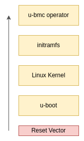

# Documentation

## List of Contents

* [Architecture Overview](#architecture-overview)
  - [u-boot](#u-boot)
  - [Linux Kernel](#linux-kernel-and-initramfs)
  - [Operator](#operator)
* [Getting Started](#getting-started)
  - [Build](#build)
  - [Boot](#boot)
  - [Communicate](#communicate)
* [Microservices](#microservices)
  - [supervisord](#supervisord)
  - [registryd](#registryd)
  - [ipcd](#ipcd)
  - [netd](#netd)
  - [apid](#apid)
  - [hardwared](#hardwared)
  - [telemetryd](#telemetryd)
  - [kvmd](#kvmd)
  - [updated](#updated)
* [Interfaces](#interfaces)
  - [gRPC](#grpc)
  - [Redfish](#redfish)

## Architecture Overview

The architecture of the u-bmc is structured around four key components: u-boot, the Linux Kernel, Initramfs, and the Operator. Each component plays a crucial role in the boot and operation process of the BMC.



### u-boot

The first stage of the boot process is [u-boot](https://docs.u-boot.org/en/latest/index.html). It is the primary bootloader that is executed directly from the reset vector. Its primary responsibilities include:

- Activating the UBIFS (Unsorted Block Image File System) partition labeled 'boot' within the 'rootfs' MTD partition.
- On the first boot, u-boot prepares the UBIFS by creating a fastmap, which can lead to a longer boot time.
- It then loads the FIT (Flattened Image Tree) image from '/boot/fitImage' into RAM, a process crucial for booting the Linux Kernel.
- u-boot performs a secure boot of the FIT image by verifying baked-in signatures to ensure the image's integrity.
- Once the image is authenticated, u-boot copies the Linux Kernel and Device Tree Blob (DTB) to RAM and hands over execution to the Linux Kernel, providing it with the DTB.

### Linux Kernel and Initramfs

After u-boot has performed its initial setup, control is transferred to the Linux Kernel. Upon receiving control from u-boot, the Linux Kernel begins its startup sequence, which includes:

- Initializing and setting up device drivers and kernel subsystems.
- Transitioning to the initramfs, an in-memory temporary root file system included within the Kernel image.
- The init binary within initramfs then takes over, which is designed to be minimalistic to ensure a swift transition to the actual root file system.
- It optionally loads an authentication key into the kernel's session keyring if UBIFS authentication is enabled.
- The init process mounts all necessary pseudo filesystems (such as proc, sys, and dev) and the 'root' and 'data' UBIFS partitions.
- Finally, it performs the `switch_root` operation, transitioning from the initramfs to the actual root file system on the 'root' UBIFS partition.
- Handing over control to the u-bmc operator running with PID 1.

### Operator

Following the `switch_root` process, the new root file system takes over with /sbin/operator as the init process (PID 1). The Operator is the central orchestrator that coordinates the BMC's boot process and oversees the operation of all microservices within the u-bmc ecosystem. 

- The operator binary encompasses the entire u-bmc userspace and represents the final step in the BMC's boot process.
- As PID 1, it orchestrates all subsequent operations within the BMC userspace.
- The operator handles all business logic within u-bmc, including service routines and external interfaces such as gRPC and Redfish served over HTTPS.
- It ensures that all management functions are performed, and services are running as expected, marking the end of the bootflow and the beginning of the operational state for the BMC.

## Getting Started

### Build u-boot

**Clone the U-Boot Repository**

First, we will clone the U-Boot source code from the OpenBMC GitHub repository.

```
git clone git@github.com:openbmc/u-boot.git u-boot
```
This command clones the U-Boot repository into a directory named u-bmc-build/u-boot in your current working directory.

**Copy the u-boot config**

Copy the configuration file needed for your board to `./u-boot/.config`. In our case, we are using the EVB-AST2500 platform.

```
cp ./u-boot/configs/evb-ast2500_defconfig ./u-boot/.config
```

**Configure the Build System**

Next, we update the default configuration to ensure it is in sync with the latest source code. This step also allows you to make any necessary old configuration defaults to be set.

```
CROSS_COMPILE=arm-none-eabi- ARCH=arm make -C ./u-bmc-build/u-boot/ olddefconfig
```

**Compile U-Boot**

Now, we can compile U-Boot using the make utility. We use the -j flag to specify the number of jobs to run simultaneously, which is typically set to the number of CPU cores on your machine to speed up the build process.

```
CROSS_COMPILE=arm-none-eabi- ARCH=arm make -C ./u-bmc-build/u-boot/ -j $(nproc)
```
After the build process completes, you will find the U-Boot binary in the u-boot root directory. This binary is what will be used as the bootloader for your BMC firmware.

## Microservices

The operator spaws multiple microservices that provide different services, either internally or externally.

### Supervisord

This service employs cgroups and namespaces for the secure launching of services in a confined environment. It also facilitates the initiation of services as goroutines in a lightweight fashion. Supervisord is responsible for restarting services that terminate with an error and recognizing the completion of one-shot services that exit with a 'nil' return value.

### Registryd

Acts as the central hub for session, user, password, group, and access right management. It maintains configurations and states, with compile-time defaults that can be overridden at runtime. The service leverages boltdb for the persistent storage of the registry on flash memory.

### Ipcd

Utilizes connectrpc to enable communication between microservices. The service operates with minimal awareness of other services, requiring no in-depth knowledge of IPC internals and adhering to a pub/sub schema. It offers a uniform interface for both isolated and lightweight services, with a broker managing authentication and routing. Ipcd assumes sockets are authenticated as it operates under PID 1, with no other parent process expected.

### Netd

Manages all network-related functions, including 9p, mctp, ntp, vlan, dhcp, addresses, and links. It sets default configurations at compile time and adjusts settings in response to IPC messages for dynamic reconfiguration.

### Apid

Provides gRPC endpoints for user interaction, supported by the connectrpc framework. It also utilizes the vanguard transcoding server to offer the same functionalities via HTTP/S RESTful endpoints. Apid aims to deliver both a minimal stateless management interface (u-mgmt) and a full Redfish interface (still in development).

### Hardwared

Gathers sensor data and maintains it in an internal in-memory cache. It responds to IPC messages to alter hardware states as required, such as toggling a GPIO or sending an I2C message.

### Telemetryd

Implements OTLP metrics, tracing, and logging. There is an ongoing decision on whether this service should act as a collector, a propagator, or a custom exporter.

### Kvmd

Manages USB KVM functionality and live media, including the creation of websockets to stream the framebuffer from the BMC.

### Updated

Oversees firmware updates for the host, BMC, and other hardware components. It is a TUF-based service that monitors an artifact repository for firmware updates and applies them when allowed. In the case of an A/B partition scheme, it can perform updates unattendedly without triggering a reboot.

## Interfaces

### gRPC

### Redfish
