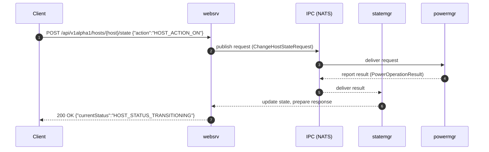

# API guide

This document explains how to access u-bmc’s public API, what protocols are supported, how REST endpoints are exposed via transcoding, and what to expect from upcoming Redfish and IPMI support.

The API and schema are currently versioned as v1alpha1.

- Primary API: ConnectRPC over HTTPS (JSON or Protobuf)
- REST: generated from protobuf HTTP annotations (google.api.http)
- Stability: endpoints and messages live under /api/v1alpha1/ and may evolve during alpha

## Transport and protocols

- Server: u-bmc’s web service (websrv)
- HTTP: HTTP/1.1 and HTTP/2, with HTTP/3 (QUIC) where supported
- TLS: always-on; development mode uses a self‑signed certificate
- Base URL: https://<bmc-host>:8443 by default (ports may differ per deployment)

When using curl against a development build with a self-signed certificate, add the --insecure flag.

## ConnectRPC

ConnectRPC is the native API. It supports JSON and Protobuf content types and works over plain HTTP semantics so it is easy to proxy and introspect.

- Client libraries are available for multiple languages
- Requests and responses are standard protobuf messages
- You can choose JSON or Protobuf on the wire

If your client supports ConnectRPC, prefer it over raw REST because:
- you get first-class, type-safe stubs
- you receive richer error metadata
- you avoid mismatches between REST shapes and protobuf envelopes

For language-specific instructions, use your ConnectRPC client of choice and point it at the websrv endpoint. The protobuf service is defined in schema/v1alpha1/*.proto (see BMCService).

## REST via transcoding

All endpoints with google.api.http annotations are exposed as REST. These are convenient for scripts and tools like curl. The paths and methods below are excerpts; refer to the schema files for the full set and exact shapes.

Notes:
- JSON field names follow the protobuf JSON mapping (lowerCamelCase)
- Enum values are serialized as their string names (e.g. "HOST_ACTION_ON")
- Path parameters populate the corresponding request fields; you can omit them from the body if they already appear in the path
- Some requests accept field masks; pass them as a comma-separated string (e.g. ?field_mask=systemInfo.name,systemInfo.version) or as a body field where a body is used

### Sequence: client → websrv → services



### System information

- GET /api/v1alpha1/system/info
- GET /api/v1alpha1/system/health

Example:

```bash
curl --insecure \
  https://$BMC/api/v1alpha1/system/info
```

Response (truncated):

```json
{
  "systemInfo": {
    "name": "bmc-01",
    "state": "SYSTEM_STATE_ENABLED",
    "health": { "status": "HEALTH_STATUS_OK" },
    "version": "0.1.0"
  }
}
```

### Hosts

- GET /api/v1alpha1/hosts
- GET /api/v1alpha1/hosts/{name}
- PATCH /api/v1alpha1/hosts/{host_name}
- POST /api/v1alpha1/hosts/{host_name}/state

Power on a host:

```bash
curl --insecure -X POST \
  https://$BMC/api/v1alpha1/hosts/host-0/state \
  -H 'Content-Type: application/json' \
  -d '{
    "action": "HOST_ACTION_ON"
  }'
```

Response:

```json
{ "currentStatus": "HOST_STATUS_TRANSITIONING" }
```

Power off a host (force hold if needed):

```bash
curl --insecure -X POST \
  https://$BMC/api/v1alpha1/hosts/host-0/state \
  -H 'Content-Type: application/json' \
  -d '{ "action": "HOST_ACTION_OFF" }'
```

### Chassis

- GET /api/v1alpha1/chassis
- GET /api/v1alpha1/chassis/{name}
- PATCH /api/v1alpha1/chassis/{chassis_name}
- POST /api/v1alpha1/chassis/{chassis_name}/state

Example (identify LED on via chassis action mapping):

```bash
curl --insecure -X POST \
  https://$BMC/api/v1alpha1/chassis/main/state \
  -H 'Content-Type: application/json' \
  -d '{ "action": "CHASSIS_ACTION_IDENTIFY_ON" }'
```

### Management controllers (BMC, satellites)

- GET /api/v1alpha1/management-controllers
- GET /api/v1alpha1/management-controllers/{name}
- PATCH /api/v1alpha1/management-controllers/{controller_name}
- POST /api/v1alpha1/management-controllers/{controller_name}/state

Example:

```bash
curl --insecure -X POST \
  https://$BMC/api/v1alpha1/management-controllers/bmc/state \
  -H 'Content-Type: application/json' \
  -d '{ "action": "MANAGEMENT_CONTROLLER_ACTION_REBOOT" }'
```

### Sensors

- GET /api/v1alpha1/sensors
- GET /api/v1alpha1/sensors/{id}

List sensors:

```bash
curl --insecure \
  https://$BMC/api/v1alpha1/sensors
```

Get a sensor by ID:

```bash
curl --insecure \
  https://$BMC/api/v1alpha1/sensors/cpu0_temp
```

Response (analog reading example, truncated):

```json
{
  "sensors": [
    {
      "id": "cpu0_temp",
      "name": "CPU 0 Temp",
      "context": "SENSOR_CONTEXT_TEMPERATURE",
      "unit": "SENSOR_UNIT_CELSIUS",
      "analogReading": { "value": 52.0 }
    }
  ]
}
```

### Thermal zones

- GET /api/v1alpha1/thermal-zones
- GET /api/v1alpha1/thermal-zones/{name}
- PUT /api/v1alpha1/thermal-zones/{name}

Update a thermal zone’s target temperature:

```bash
curl --insecure -X PUT \
  https://$BMC/api/v1alpha1/thermal-zones/chassis \
  -H 'Content-Type: application/json' \
  -d '{
    "name": "chassis",
    "targetTemperature": 45
  }'
```

### Asset and inventory

- GET /api/v1alpha1/asset
- PUT /api/v1alpha1/asset

Query by fields (choose one identifier in the body when using PUT):

```bash
curl --insecure \
  'https://'$BMC'/api/v1alpha1/asset?field_mask=productName,serialNumber'
```

### Users

- POST /api/v1alpha1/users
- GET /api/v1alpha1/users
- GET /api/v1alpha1/users/{id}
- PATCH /api/v1alpha1/users/{user.id}
- DELETE /api/v1alpha1/users/{id}
- POST /api/v1alpha1/users/{id}/change-password
- POST /api/v1alpha1/users/{id}/reset-password
- POST /api/v1alpha1/auth/authenticate

Create a local user:

```bash
curl --insecure -X POST \
  https://$BMC/api/v1alpha1/users \
  -H 'Content-Type: application/json' \
  -d '{
    "user": {
      "id": "u-1001",
      "username": "operator",
      "enabled": true,
      "createdAt": "2024-01-01T00:00:00Z",
      "updatedAt": "2024-01-01T00:00:00Z",
      "sourceSystem": "USER_SOURCE_LOCAL",
      "creationInterface": "USER_CREATION_INTERFACE_SCHEMA_API"
    },
    "password": "example-strong-pass"
  }'
```

Authenticate (when enabled):

```bash
TOKEN=$(curl --insecure -s -X POST \
  https://$BMC/api/v1alpha1/auth/authenticate \
  -H 'Content-Type: application/json' \
  -d '{"username":"operator","password":"example-strong-pass"}' \
  | jq -r .token)
```

Then call any endpoint with:

```bash
curl --insecure \
  -H "Authorization: Bearer $TOKEN" \
  https://$BMC/api/v1alpha1/system/health
```

Authentication and authorization policies are deployment-dependent. If your environment requires tokens, always provide the Authorization header.

## JSON mapping, enums, and masks

- Fields use protobuf JSON mapping (e.g. host_name → hostName)
- Enums use string names (e.g. "HOST_STATUS_ON")
- Field masks:
  - In query: use field_mask=comma,separated,paths
  - In JSON body (where bodies are accepted): provide a fieldMask string if present in the request type

The exact field names and available enums are defined in schema/v1alpha1/*.proto. Treat those files as the authoritative reference.

## Error handling

- REST errors map to appropriate HTTP status codes
- The response body is JSON and includes a message; ConnectRPC clients get richer error details
- Validation is performed using protobuf constraints (buf/validate); error messages reflect the violated rule when possible

## Versioning

The API is under v1alpha1. Expect additive changes and occasional adjustments during alpha. Track changes through the protobuf schema and release notes.

## Redfish and IPMI

- Redfish: a core set of Redfish resources is planned. The Redfish layer will map to the same services (statemgr, sensormon, powermgr) that back ConnectRPC/REST.
- IPMI: legacy IPMI support is planned. The server will implement required command sets and bridge them to internal services. This enables compatibility with existing tooling without duplicating logic.

These compatibility layers are separate entry points and do not replace the primary ConnectRPC API.

## Tips

- Prefer ConnectRPC clients for type safety and better errors
- Use REST for quick inspection or shell scripting
- Use HTTP/3 if your environment supports it; otherwise HTTP/2 is fine
- In development, the server presents a self-signed cert; use --insecure during local testing only
- For platform-specific behavior (e.g. available sensors or power actions), see your target’s documentation under targets/

## References

- schema: schema/v1alpha1/*.proto
- services: service/ (websrv, statemgr, powermgr, sensormon, etc.)
- high-level: docs/overview.md and docs/architecture.md
