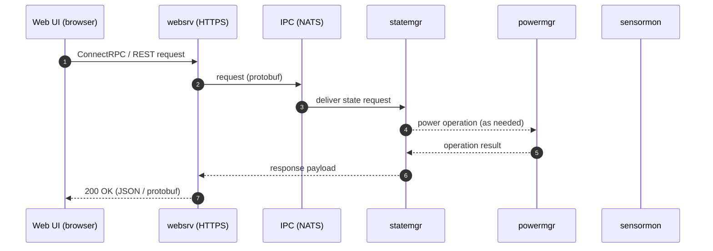

# Web UI

This document describes the scope and integration model of the u-bmc Web UI and explains where detailed developer documentation lives.

## Purpose and scope

The Web UI provides a browser-based management interface for common operator tasks. It consumes the same public API as any other client:

- Primary API: ConnectRPC over HTTPS with JSON and Protobuf payloads
- REST: automatically exposed via protobuf HTTP annotations
- Base path: /api/v1alpha1/…

The initial scope focuses on daily operations:
- Power and state control for hosts, chassis, and the BMC
- Live sensor views and basic inventory
- User management and session handling
- A minimal event/status view

Follow-on features such as KVM and Serial-over-LAN (SOL) will reuse the same service graph and transport through `websrv`.

## Architecture

The Web UI talks only to `websrv`. The web server validates requests, performs protocol translation, and routes them through NATS to the appropriate backend services. There are no direct connections from the UI to other services.

In production, `websrv` can serve the compiled Web UI assets alongside the API. QUIC (HTTP/3) is supported when enabled, with automatic fallback to HTTP/2 and HTTP/1.1.

## Project layout and technology

- The `webui` directory contains the Web UI source. It uses modern frontend tooling (SvelteKit) and includes a `src-tauri` subdirectory for an optional Tauri shell.
- The Web UI communicates exclusively with `websrv` using the public API. It does not reach into internal services or bypass the API layer.

A dedicated README in `webui/` is allowed and should contain developer-focused details such as local development, build, and test workflows. See `webui/README.md`.

## API and authentication

All UI interactions use the same endpoints documented in [docs/api.md](api.md). Authentication and authorization are enforced by `websrv`:
- TLS is always on. Development builds use a self-signed certificate.
- The server may use session cookies or bearer tokens depending on deployment.
- Role-aware handlers govern what the UI can read and change.

The Web UI does not implement business logic; it renders server-side state and sends explicit, auditable API requests.

## Development and production

- Development: the UI targets the `websrv` API endpoint over HTTPS. Refer to `webui/README.md` for environment setup and useful scripts.
- Production: `websrv` serves the compiled assets and the API from the same origin. This minimizes CORS complexity and simplifies deployment.

## Feature roadmap alignment

Planned UI surfaces include:
- KVM: browser viewer for remote video and HID input (via `kvmsrv` through `websrv`)
- SOL: browser terminal for host serial (via `consolesrv` through `websrv`)
- Updates: A/B flows, progress, and rollback (`updatemgr`)
- Redfish/IPMI: compatibility layers presented consistently with existing UI flows

The central roadmap in [docs/roadmap.md](roadmap.md) tracks delivery sequencing and priorities.

## Documentation policy and ownership

- The Web UI may have its own README under `webui/` (allowed exception).
- Package-level documentation for Go code remains in `doc.go` files and API comments.
- Cross-cutting, user-facing documentation lives in `docs/`.

## References

- [docs/api.md](api.md) — how to access and query the API
- [docs/overview.md](overview.md) — system overview
- [docs/architecture.md](architecture.md) — service graph and operator model
- [docs/roadmap.md](roadmap.md) — current backlog and planned features
- [webui/README.md](../webui/README.md) — developer guide for the Web UI
